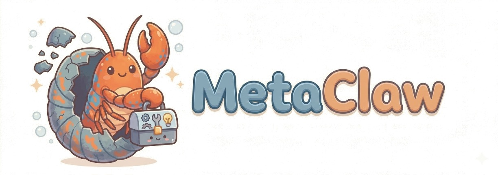

<div align="center">



<br/>

### 只需与你的 Agent 对话 —— 它会不断学习，持续进化。

<p>
  <a href="https://github.com/aiming-lab/MetaClaw"></a>
  <a href="LICENSE"></a>
  
  
  
</p>

<p align="center">
  <video src="assets/video.mp4" controls width="600"></video>
</p>

</div>

---

## 🔥 最新动态

- **[2026/03/07]** 正式发布 **MetaClaw** —— 基于 Tinker 云端 LoRA 的 CLI Agent 在线 RL 训练框架，内置 Skills 注入与 Skill 自动进化能力。

---

## 📖 概述

**MetaClaw** 在后台对真实对话进行持续训练 —— 每轮对话注入相关 Skills，失败时自动生成新 Skills。你只需和 Agent 正常对话，MetaClaw 在幕后完成其余一切。

它将你的模型封装为 OpenAI 兼容 API，通过 OpenClaw 拦截实时对话、对每轮打分，并持续微调策略 —— 新权重热更新，无需重启，零中断。

无需 GPU 集群。核心基于 **Kimi-2.5**（约 200B MoE）通过 [Tinker](https://www.thinkmachines.ai/) 云端 LoRA 运行，也支持以 Qwen3-4B 作为轻量替代方案。

## 🤖 核心特性

**Skills 注入。** 每轮对话时，系统自动检索相关 Skill 指令并注入 Agent 的 system prompt —— 无需重新训练，即可立即改善行为。

**Skill 进化。** Agent 失败时，由 LLM 自动分析失败轨迹并生成新 Skill。Agent 真正从自身失败中变得更智能。

**无需 GPU 集群。** 训练在 Tinker 云端运行，任何有网络连接的机器即可使用。

**完全异步。** 推理服务、奖励打分、模型训练完全解耦。训练在后台进行，模型持续响应不间断。

**两种学习模式。** RL（GRPO）用于隐式反馈，On-Policy Distillation（OPD）用于将更大的教师模型蒸馏到学生模型。OPD 模式下，学生模型正常生成回复，教师模型对相同回复提供逐 token 的 log-probability，传入损失函数（如 `cispo`）使学生逐步逼近教师分布。教师模型需部署在 OpenAI 兼容的 `/v1/completions` 端点（如 vLLM、SGLang）。

---

## 🚀 快速开始

### 1. 安装依赖

```bash
pip install fastapi uvicorn httpx openai transformers
pip install tinker tinker-cookbook   # Tinker SDK
```

### 2. 配置 OpenClaw

运行一次初始化脚本，将 OpenClaw 网关指向 MetaClaw 代理：

```bash
bash openclaw_model_kimi.sh   # Kimi-2.5（推荐）
```

### 3. 启动训练

```bash
export TINKER_API_KEY="..."
cd /path/to/metaclaw
python examples/run_conversation_rl.py
```

完成！开始与 Agent 对话，MetaClaw 将自动收集对话轮次、评分并训练模型。每累积 `batch_size` 个样本后，新权重即热更新，无需重启。

---

## ⚙️ 配置说明

所有配置项位于 `MetaClawConfig`（`metaclaw/config.py`）。常用字段如下：

| 字段 | 默认值 | 说明 |
|------|--------|------|
| `model_name` | `"moonshotai/Kimi-2.5"` | 基础模型 |
| `lora_rank` | `32` | LoRA rank |
| `batch_size` | `32` | 触发一次训练步所需样本数 |
| `max_steps` | `1000` | 最大训练步数 |
| `loss_fn` | `"importance_sampling"` | `"importance_sampling"` / `"ppo"` / `"cispo"` |
| `use_prm` | `True` | 是否启用 PRM 奖励打分 |
| `prm_url` | `"https://api.openai.com/v1"` | 任意 OpenAI 兼容的 judge 服务地址 |
| `prm_model` | `"gpt-5.2"` | Judge 模型 |
| `use_opd` | `False` | 是否启用 OPD（教师 logprobs）模式 |
| `teacher_url` | `""` | 教师模型 base URL（OpenAI 兼容 `/v1/completions`） |
| `teacher_model` | `""` | 教师模型名称 |
| `teacher_api_key` | `""` | 教师模型 API key |
| `kl_penalty_coef` | `1.0` | OPD 的 KL 惩罚系数 |
| `use_skills` | `False` | 是否启用 Skill 注入 |
| `enable_skill_evolution` | `False` | 是否自动从失败中生成新 Skill |
| `proxy_port` | `30000` | 代理服务器监听端口 |
| `tinker_sampling_url` | `"http://localhost:8080"` | Tinker sampling 服务地址 |

如需程序化 Rollout（无需 IDE），可将 `openclaw_env_data_dir` 指向一个 JSONL 任务文件目录：

```json
{"task_id": "task_1", "instruction": "在 https://example.com/hook 注册 webhook"}
```

---

## 💪 Skills

Skills 是注入 Agent system prompt 的简短 Markdown 指令，按类别（`coding`、`security`、`agentic` 等）组织，存储在 `memory_data/conversation/conversation_skills.json`。

启用方式：

```python
config = MetaClawConfig(use_skills=True)
```

开启自动 Skill 进化（当 Agent 表现不佳时自动生成新 Skill）：

```python
config = MetaClawConfig(
    use_skills=True,
    enable_skill_evolution=True,
    azure_openai_deployment="gpt-5.2",
)
```

```bash
export AZURE_OPENAI_API_KEY="..."
export AZURE_OPENAI_ENDPOINT="https://your-endpoint.openai.azure.com/"
```

---

## 📚 引用

```bibtex
@misc{xia2026metaclaw,
  author       = {Xia, Peng and Chen, Jianwen and Yang, Xinyu and Han, Siwei and Qiu, Shi and Zheng, Zeyu and Xie, Cihang and Yao, Huaxiu},
  title        = {MetaClaw},
  year         = {2026},
  organization = {GitHub},
  url          = {https://github.com/aiming-lab/MetaClaw},
}
```

---

## 🙏 致谢

MetaClaw 基于 [OpenClaw](https://openclaw.ai) 和 [Tinker](https://www.thinkmachines.ai/) 构建。RL 设计受 [OpenClaw-RL](https://github.com/Gen-Verse/OpenClaw-RL) 启发。Skill 库参考了 [awesome-openclaw-skills](https://github.com/VortAgent/awesome-openclaw-skills)。
